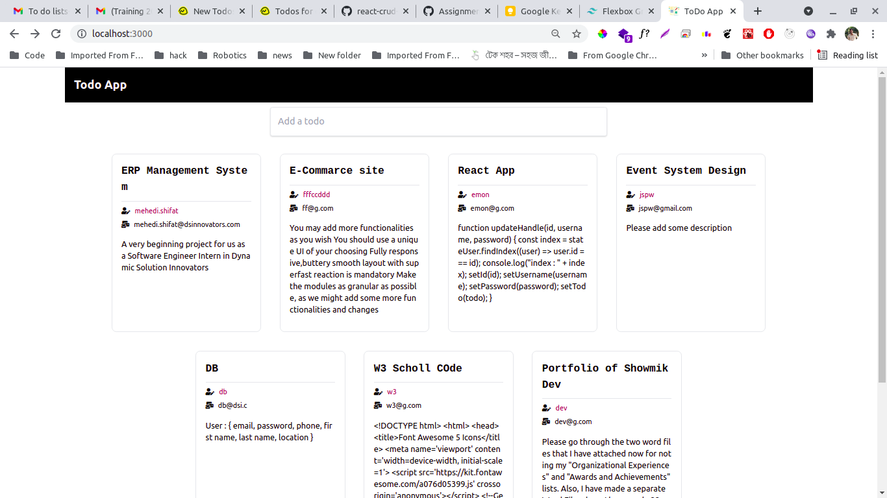
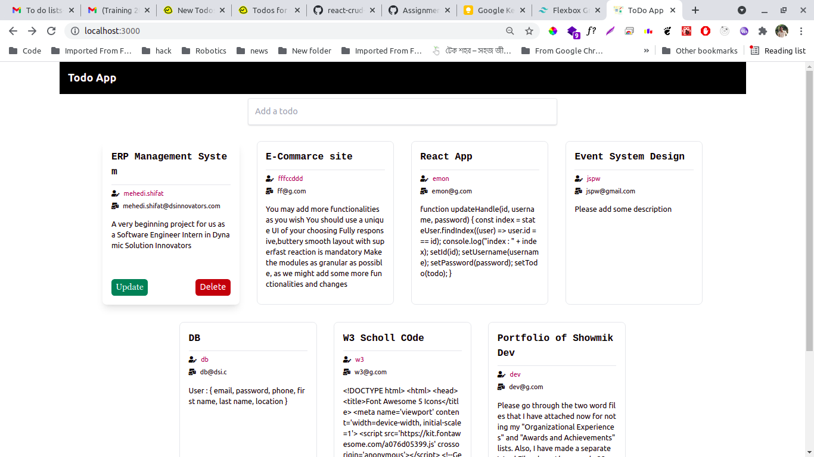
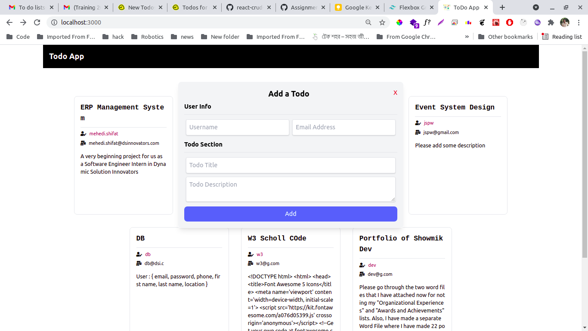
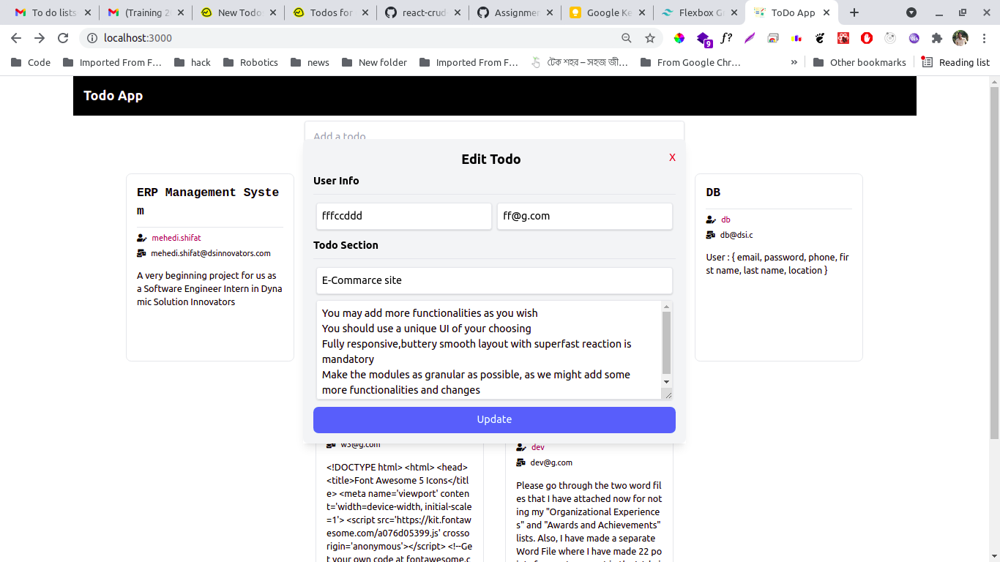
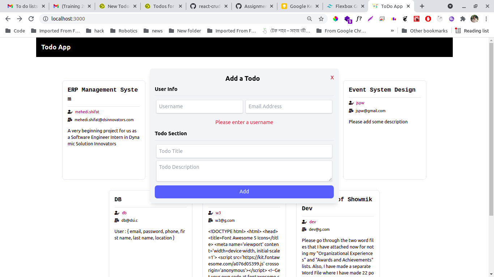

# Todo App

## Intro

Todo App is a simple ReactJS CRUD application. As intern in DSinnovators we are going through some session (**javascript**, **react** for now) and some tasks are given by our mentor. Todo App is the 2nd task.

<p align='center'>Hosted on : <a href="https://jspw.github.io/simple-todo">jspw.github.io/simple-todo</a<</p>

## About Task

```
You are to write a to-do application using the following tools:
React (of course)
Local State Management
It will allow the user to input 3 fields, which will later be shown in a single div/card:
name
email
to-do
Users will be able to create,update and delete those div/cards (containing name,email and to-do)

The design will be responsive, no need to make it pretty, functionality over aesthetics.

```

## Tech Stack

- ReactJs
- TailwindCss

## Feature

- Add | Update | Delete todo
- Local Storage
- Responsive

## Git Workflow

- dev -> main

## For Developers

### How to config React App with TailWindCSS?

- Install tailwind with necessary stuffs :
  `npm install -D tailwindcss@npm:@tailwindcss/postcss7-compat postcss@^7 autoprefixer@^9`

- Init tailwindcss :

  `npx tailwindcss-cli@latest init`

- Create a file named `craco.config.js` in root dir

  ```.js
  module.exports = {
  style: {
      postcss: {
      plugins: [require("tailwindcss"), require("autoprefixer")],
      },
  },
  };

  ```

- Change `index.css`

  ```.css
  @tailwind base;
  @tailwind components;
  @tailwind utilities;
  ```

## Screenshots

### Desktop






